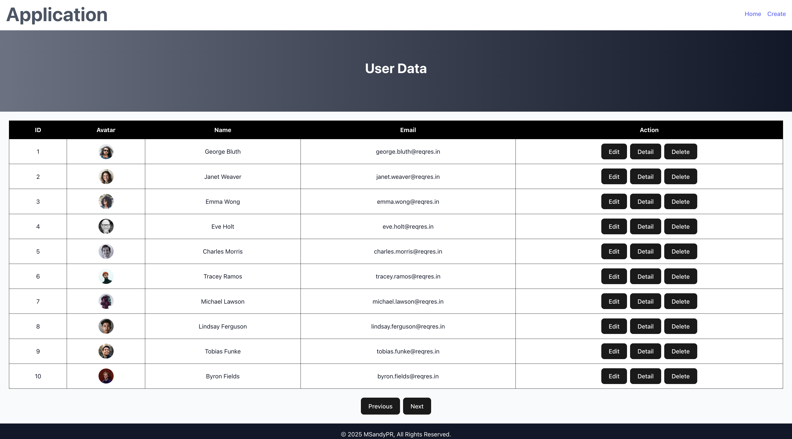

# Simple React.js API Request

A simple user management application built with React, Vite, and Tailwind CSS. This app demonstrates CRUD (Create, Read, Update, Delete) operations using the https://reqres.in API.

### Features
- View Users: Fetch and display a list of users from the API.
- User Details: View detailed information about a specific user in a modal.
- Add User: Create a new user using a form (simulated POST request).
- Edit User: Update user information (simulated PUT request).
- Delete User: Remove a user from the list (simulated DELETE request).

### Tech Stack
- React
- Vite
- TailwindCSS
- React Router DOM
- Reqres.in (for mock user data)

## Instalation
1. Clone the repository
```
git clone https://github.com/msandypr/reqres-react-simple-api.git
cd reqres-react-simple-api
```
2. Install dependencies
```
npm install
```
3. Run the development server
```
npm run dev
```

## Explanation
### Home Page
Displays a list of users fetched from the API.
Features:
- View User Details: Click the "Detail" button to open a modal with user information.
- Edit User: Click the "Edit" button to navigate to the Edit page.
- Delete User: Click the "Delete" button to remove a user (simulated DELETE request).
### Create Page
A form to add a new user.
Features:
- Input fields: First Name, Last Name, Email, and Avatar URL.
- Simulated POST request to add a new user.
### Edit Page
A form to update user information.
Features:
- Pre-filled fields with existing user data.
- Simulated PUT request to update user details.
### API Endpoints
- Get Users: GET https://reqres.in/api/users
- Get Single User: GET https://reqres.in/api/users/:id
- Create User: POST https://reqres.in/api/users
- Update User: PUT https://reqres.in/api/users/:id
- Delete User: DELETE https://reqres.in/api/users/:id


